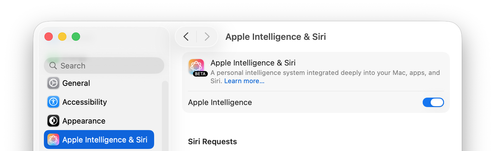

# ReSwifter

ReSwifter is a both a Snippet Manager app and an XCode Editor Extension. It is lightweight, but feature-rich. In addition to typical features found in a Snippet Manager, ReSwifter also offers several local-AI-assisted tasks on your code snippets.

## Features and Behaviour
- New snippets from clipboard are briefly summarized and named automatically
- One-click copy to clipboard, or use keyboard shortcuts
- Live code editing of snippets with syntax highlighting
- Syntax highlighting supports 48 programming languages, which can be overridden
- Adaptive syntax highlighting for Dark and Light modes set by the system
- Folder management, favourites, and search filter assist in finding your snippets
- Folders named after programming languages automatically applies the language's highlighting to new snippets in that folder
- AI-assisted tasks: Explain, Document, Review, Cleanup, Refactor, Convert to Swift*
- AI features use Apple's built-in FoundationModels, which works completely offline (privacy)
- Rich, structured text responses from AI-assisted features (not editable)
- Copy to clipboard button will copy only code blocks from AI responses; use manual selection to copy non-code

\**Note: Accuracy, consistency or reliability of AI-assisted tasks are to be considered with discretion. The language, length, complexity and nature of a snippet, and the AI task can all be combined factors in the quality of the result. Always double-check AI output before accepting it.*

### XCode Extension
- Selected text in XCode can be sent directly to ReSwifter via the Editor menu, and any snippet can be sent back to replace it
- Invoking ReSwifter from XCode with no selection will send the entire contents of the currently opened file, which can be replaced by an augmented version

## Requirements
Apple M1 or later hardware runing macOS Tahoe 26 or later is required. For the AI-assisted capabilities to work, you will need Apple Intelligence enabled (and downloaded) in your System Settings. You may have to restart ReSwifter after the model is downloaded.

## Author
ReSwifter (C) 2026 Jeffrey Bakker

### Credits
- Live snippet editing with syntax highlighting uses [HighlightedEditorView](https://github.com/jsbakker/HighlightedEditorView), by Jeffrey Bakker.
- Markdown and code blocks for AI Responses are rendered with [Textual](https://github.com/gonzalezreal/textual), by [Guille Gonzalez](https://github.com/gonzalezreal).
